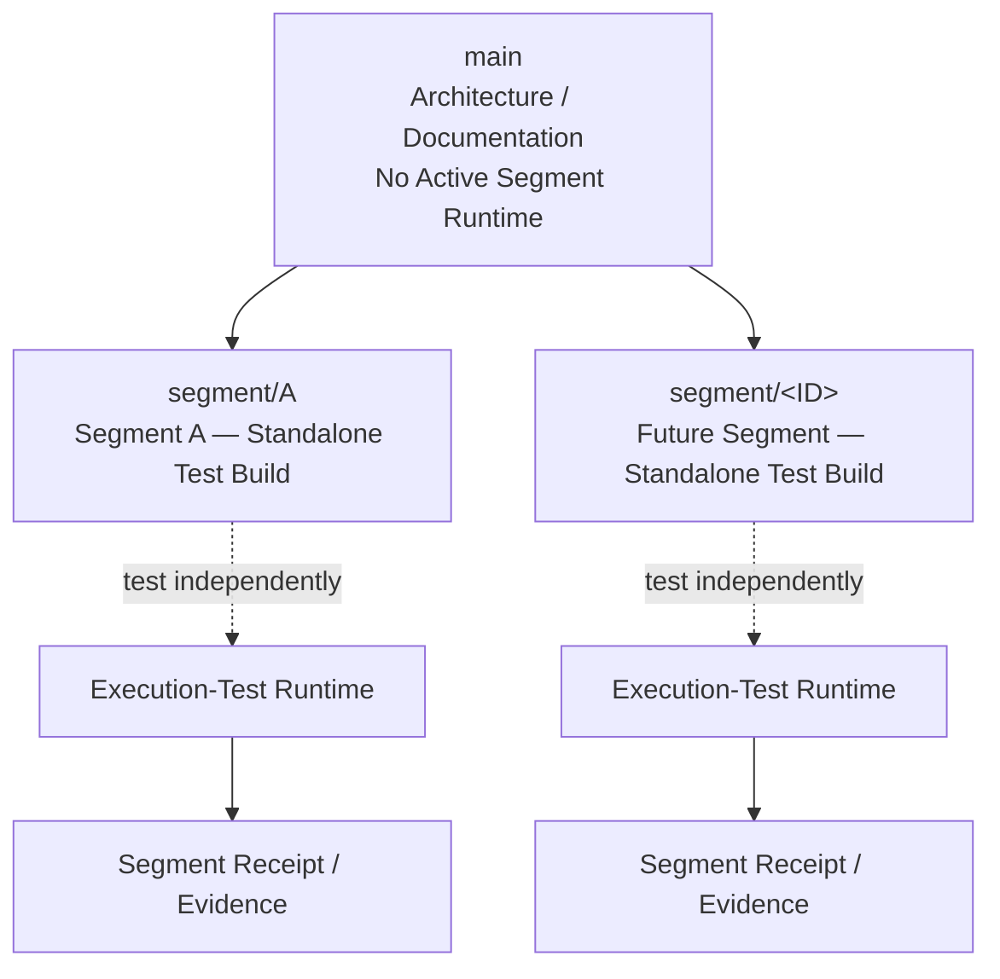
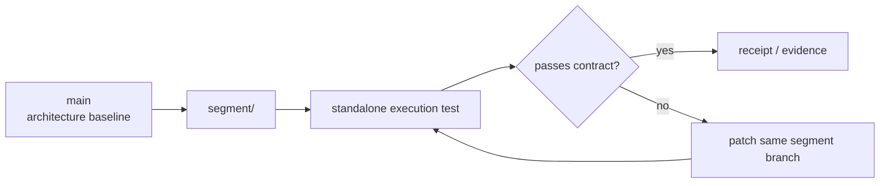

# MARA Segments — Execution Test Repository

This repository is a **segment-isolated execution test environment**.

The `main` branch is the architecture and navigation plane. It does **not** contain the active executable implementation of any pipeline segment.

Each executable segment lives on its own branch and is tested independently before any later integration work.

## Repository Topology



## Branch Rule

Every segment branch is created from `main`.

```text
main
├── segment/A
├── segment/<next-segment>
├── segment/<next-segment>
└── ...
```

A segment branch contains only the implementation and test material required for that segment's standalone execution test.

## Main Branch Responsibility

`main` contains:

- repository architecture;
- pipeline/branch diagrams;
- branch naming rules;
- cross-segment test conventions;
- navigation documentation.

`main` does not contain:

- the active Segment A runtime;
- active Segment B/C runtime code;
- merged multi-segment execution code;
- production/full-pipeline runtime code.

## Segment Branch Responsibility

Each `segment/<ID>` branch owns:

1. that segment's executable build;
2. segment-local fixtures;
3. segment-local tests;
4. validation/fail-closed checks;
5. execution receipts or test evidence;
6. documentation specific to that segment.

Changes to one segment must not silently modify another segment branch.

## Test Flow



## Current Segment

`segment/A` is reserved for the Segment A standalone execution-test build.

Its implementation is intentionally kept off `main`.


## Segment C Layout Dossier

The complete layout dossier for Segment C is registered at:

- [NotebookLM Layout Dossier](docs/NOTEBOOKLM_LAYOUT_DOSSIER.md)

The dossier is the authoritative source collection for the résumé layout family used by C3–C5. Repository-normalized audit material remains in `docs/BUILD_SPEC_VOL_2.md`.

## Canonical SDNA boundary

Spatial DNA has one canonical serialization: **YAML**. Segment C does **not** accept SDNA YAML or SDNA JSON as an ingress. C begins only from the sealed Stage B handoff envelope. Candidate identity, admitted propositions, evidence ceilings, semantic priorities, lineage, and the verified sidecar tombstone must already be present in that handoff. Reopening raw SDNA in C is a boundary violation.
